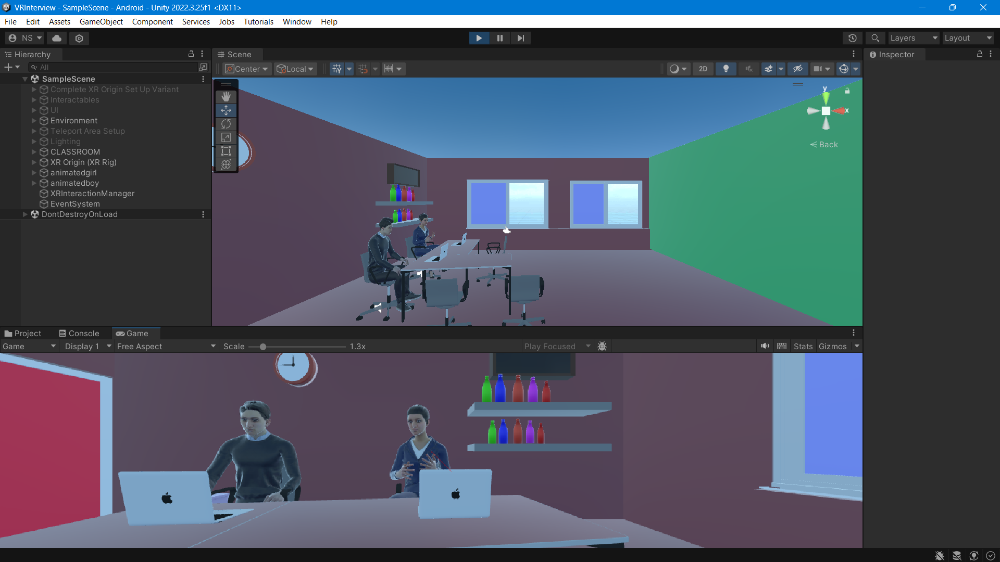
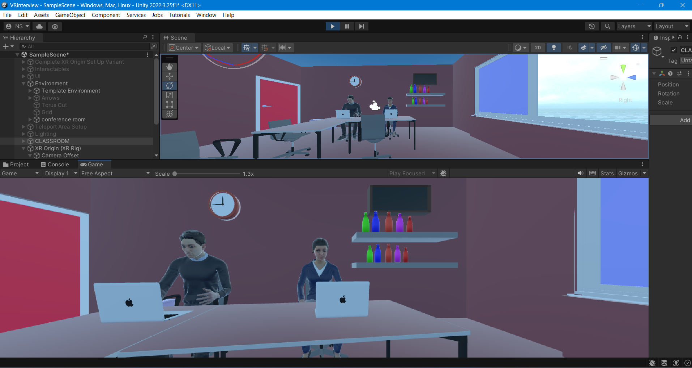
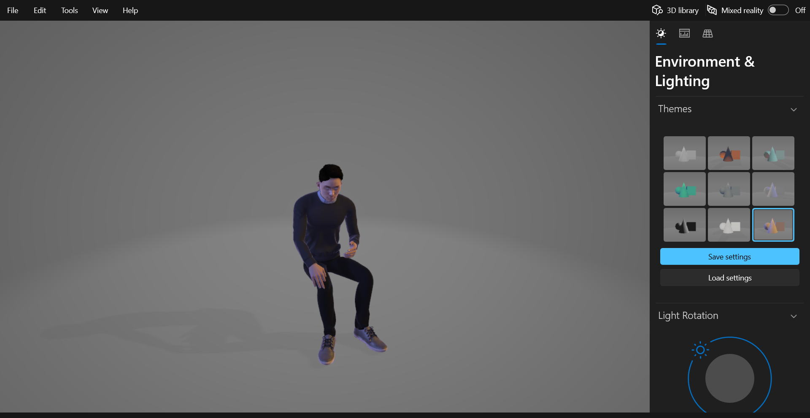
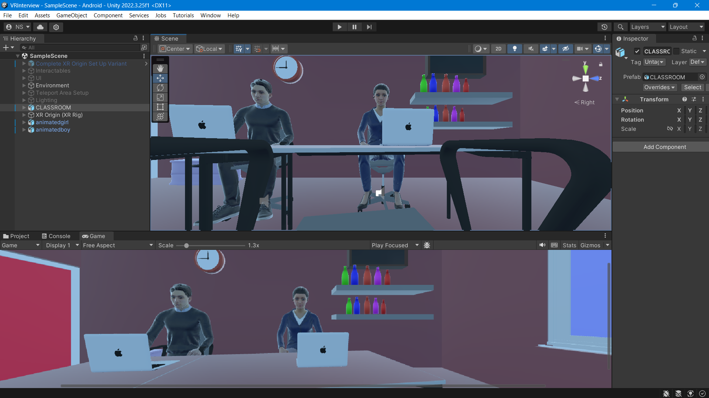
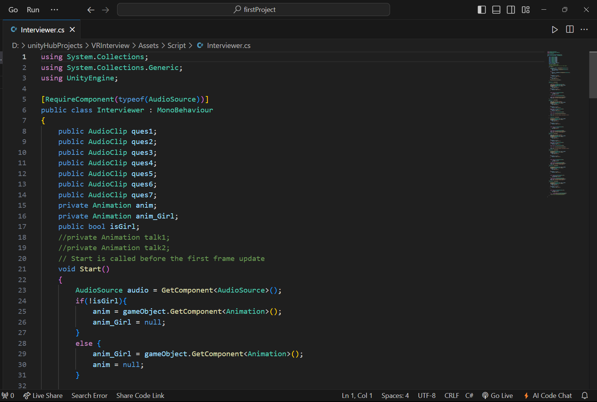

The MetaInterview in the metaverse is a virtual space where people gather to attend events, presentations, and performances in a shared digital environment. Utilizing VR technology, participants can immerse themselves in a variety of experiences, from virtual conferences and interview to educational seminars and art exhibitions. This digital auditorium offers the freedom of movement, social interaction, and access to diverse content, bridging geographical barriers and fostering community engagement in a virtual realm.

Created animated interviewer characters with Blender, integrating 3D models,real interview-based office environment and AI-generated voice for realistic, immersive interactions.

<a href="">
</img>
</img> 
</a>

#Animated interviewer characters using Blender:

<a href="">
</img>
</a>

#Real interview-based office environment:

<a href="">
</img>
</a>

#Implemented C# as a scripting language.

<a href="">
</img>
</a>
